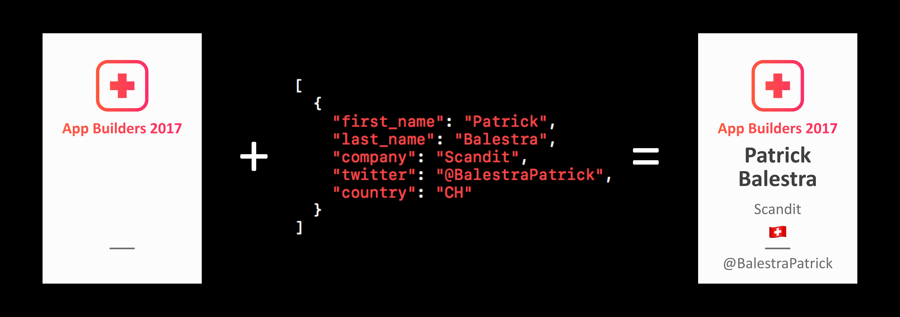

# App Builders Badge Generator

After manually designing hundreds of personalized badges for [App Builders 2016](http://2016.appbuilders.ch) and [The Swift Alps](http://theswiftalps.com), I knew I had to find a faster way. 

This playground takes care of rendering all personalized badges using the new `UIGraphicsRenderer` API available in iOS 10. Just provide your own JSON file with the parameters that you want to customize such as first name, last name, company name, twitter name and country of birth. 

The playground will generate the JPG images in the directory of the Playground (which is logged in the debbuger for your convenience).

## Usage
Feel free to use the code for your own conference bagdes generation. Modify the `attendees.json` with your attendees data. 
If you want to add or remove fields from the badge, modify the struct `Attendee`. To modify the design of the badge, check out the `Rendering` class.
You can also import a custom font to use in your drawing context.

Let me know if you used this project for your own event, I'd love to hear from you!

## Author

I'm [Patrick Balestra](http://www.patrickbalestra.com).
Email: [me@patrickbalestra.com](mailto:me@patrickbalestra.com)
Twitter: [@BalestraPatrick](http://twitter.com/BalestraPatrick).

## License

`BadgesGenerator` is available under the MIT license. See the [LICENSE](LICENSE) file for more info.
